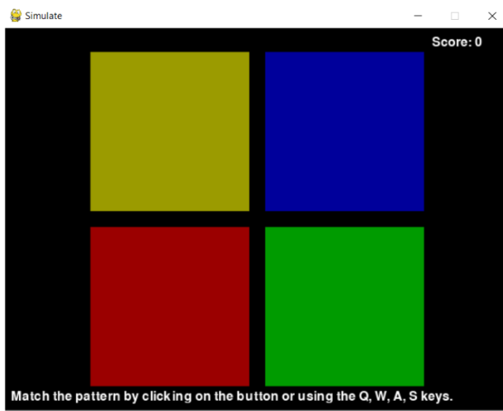

## **README Outline**

## **Introduction**

**App Name**: Tomogatchi

**Purpose of the App**:  A gaming application that allows users to take care of a virtual pet. Users of this application will be students, or people interested in caretaking games, and to help foster a sense of responsibility and accountability. 

* **Features**:  
  * **Interactive Care System**: Feed, clean, and play with your pet to keep it happy and healthy.  
  * **Dynamic Mood Tracking**: Your Tamagotchi reacts to how well you care for it.  
  * **Customization Options**: Name your pet and watch it grow over time.  
  * **Simple and Fun UI**: User-friendly interface powered by ttkbootstrap for a polished, modern look.  
  * **Emotional connection:** The design encourages players to bond emotionally with their virtual pet, making them feel responsible for its well-being.

### **2\. Installation Instructions**

**Installation Steps**:

\*Note this application is only Windows accessible a Mac version may be included in a later release\*

1. Step-by-step guide on how to download the app  
   2. To begin, download the zip file from this repository: [https://github.com/Danielle-Pagano/CSI2999-panthers](https://github.com/Danielle-Pagano/CSI2999-panthers)  
   3. To download the zip file, click on the green code button and navigate to “download zip”  
   4. Go to your downloads folder and find the zip file named “CSI2999-panthers.zip”  
   5. Extract the zip file to your desired location  
   6. Within the folder, Run “TomogatchiAPP.exe”  
   7. If this window appears:

      
   8. 
   9. Click “More Info” and select “Run anyway”  
   10. Tomogatchi’s main screen should appear:
   11. 
   12.   
   13. Congratulations you successfully downloaded the game.

For easy game access, Users can pin the “TomogatchiAPP” application to the taskbar or send it to the desktop.

**Registration Instructions**

Tomogatchi allows for registration so the game process can be saved and linked to users progress

1. Click Register  
2. Enter your first and last name, email address, unique password, and confirm password.  
3. Next, the user can enter your new pet’s name and species.  
   1. The game currently offers Squirrel and Pigeon.  
      
4. Once all fields are completed, select register.  
5. Congratulations, you have successfully registered.

**Login**

1. To log in type in your email address and password  
2. Then select login

**Game Play Instructions**

1. After registering or logging in, the user will be welcomed with this screen  
     
2. The pet screen is a representation of their health.![][image5]  
3. The **Play Button** allows the user to increase the pet's **Happiness Bar**. When pressed it will open a separate screen for a tile-based Simon says where the user must replicate the flashes on the screen, with an additional step each round.  
   1.   
      1. To play a tile-based Simon game, the user must carefully observe a sequence of tiles that are revealed. They must try to replicate that sequence by tapping the tiles in the same order; with each correct round, the sequence gets longer and more complex, and if a player taps the wrong tile, they lose the game.   
4. The **Feed Button** opens a separate screen with two food options: Acorn or Sunflower seeds. Both food choices increase the pet’s **Hunger Bar.**  
   1.  
5. The **Rest Button** will put the pet to sleep, this is important to restore the pet’s **Energy Bar**. Clicking on the Rest button a second time will wake the pet up.  
6. The **Home Button** returns the user to the home screen.

**The Main Objective**

Take good care of the virtual pet and ensure it remains happy and healthy indicated by its **Energy, Hunger,** and **Happiness Bars.** Pets will remain healthy by feeding them, playing with them, and making them sleep. If the pet is left neglected then they could “die”. If the pet dies, it can be revived by being fed or going to sleep.

### **Troubleshooting and FAQs**

* **Common Issues**:  
  * If you are operating on a Mac, the application will not open on your device.  
* **FAQs**:  
  * Can my pet die?  
    * Technically yes. But don’t worry, the application will allow you to revive your pet by putting it to sleep or feeding it.  
  * Can I have more than one pet?  
    * You can only have one pet per account.  
  * Can I change my pet’s name?  
    * No, you cannot change your pet’s name.

**Contact Information**

If there are any issues with the application please contact daniellelrpagano@oakland.edu
